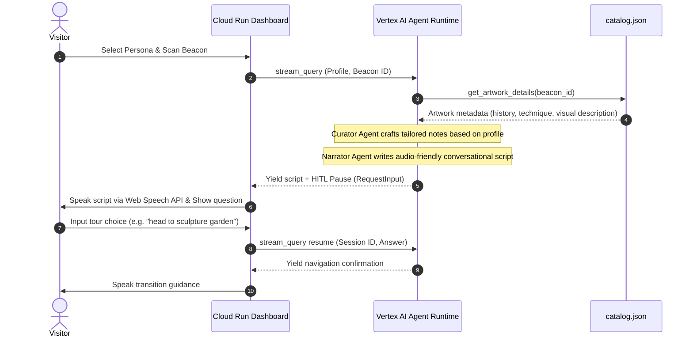

# Clio — Accessible AI Museum Guide

> **Clio** (/ˈklaɪ.oʊ/) — Named after the Greek muse of history, Clio is an autonomous, multi-agent AI audio guide that makes art exhibits accessible and engaging for everyone.

By dynamically adapting artwork narrations based on visitor profiles, Clio creates personalized experiences for **visually impaired visitors** and **art history students** alike — same painting, completely different guided experience.

### 🔗 Live Demo

> **[https://museum-companion-dashboard-967471158160.us-east1.run.app](https://museum-companion-dashboard-967471158160.us-east1.run.app)**

---

## 🏛️ Project Vision & Track (Agents for Good)

Traditional museum guides are static, one-size-fits-all audio recordings. They fail to describe visual details in a sensory-rich way for visually impaired guests, and they bore advanced art students with surface-level explanations. Clio uses agentic workflows to dynamically customize narrations on the fly:

- **👁️ Visually Impaired Profile:** Focuses on literal descriptions — spatial orientation, colors, shapes, brushstroke texture (such as Van Gogh's thick *impasto*), and physical dimensions.
- **🎓 Art History Student Profile:** Bypasses visual layout to detail the artist's historical context, socio-political influences, technique, provenance, and conservation history.

Deployed on **Vertex AI Agent Runtime** with a **Model Context Protocol (MCP)** server for artwork catalog lookup, this project demonstrates a production-ready, secure infrastructure leveraging state-of-the-art Google Cloud AI services.

---

## 🏗️ Decoupled System Architecture

Following enterprise-grade patterns, the system is split into two independently deployed services:

```
ai-agents/
├── museum-companion/              # Agent Backend (Vertex AI Agent Runtime)
│   ├── app/
│   │   ├── agent.py               # ADK Workflow: Curator → Narrator → HITL
│   │   ├── agent_runtime_app.py   # Entrypoint for Agent Runtime deployment
│   │   └── catalog.json           # Artwork database (9 pieces: paintings + sculptures)
│   ├── mcp_server.py              # FastMCP server for local development
│   ├── agents-cli-manifest.yaml   # agents-cli deployment config
│   └── pyproject.toml
│
└── museum-companion-dashboard/    # Frontend Service (Cloud Run)
    ├── main.py                    # FastAPI + Glassmorphism UI + Web Speech TTS
    ├── Dockerfile
    └── pyproject.toml
```

### Communication Flow



---

## 🛠️ Multi-Agent Orchestration (ADK)

The backend uses the **Google Agent Development Kit (ADK)** to orchestrate a **Directed Acyclic Graph (DAG) Workflow** with three stages:

### 1. Curator Agent
- Uses `gemini-2.5-flash` with the `get_artwork_details` tool
- Configured with `output_schema=CuratorOutput` to enforce structured JSON output
- Analyzes the visitor's profile to decide what aspects of the artwork to emphasize
- Outputs a focused bulleted guide plan

### 2. Narrator Agent
- Takes the Curator's structured notes as input
- Configured with `output_schema=NarratorOutput` for clean text output
- Produces warm, conversational narration scripts free of markdown symbols
- Optimized for Text-to-Speech playback

### 3. deliver_and_ask (HITL Node)
- Annotated with `@node(rerun_on_resume=True)` to support session interruption
- Yields `RequestInput` to pause execution and prompt the visitor
- On resume, processes the visitor's answer and provides navigation guidance

### Artwork Catalog (MCP)
The artwork database (`catalog.json`) contains **9 pieces** spanning **6 paintings** and **3 sculptures** — from Van Gogh's *Starry Night* to Michelangelo's *David* and the *Venus de Milo*. Each entry includes detailed history, visual description, technique, dimensions, and gallery location. A **FastMCP server** (`mcp_server.py`) wraps the lookup tool for local development via stdio transport.

---

## 🔒 Security & IAM Isolation

Zero-trust credential management is enforced:

- **No API keys or passwords** are committed in source code or Docker images (verified via automated grep scan)
- **`.env` files are gitignored** — all sensitive configuration uses environment variables
- The dashboard authenticates to Vertex AI using **Application Default Credentials (ADC)**
- Cloud Run service account is granted `roles/aiplatform.user` via **IAM policy binding** — minimum-privilege access
- **Decoupled architecture** isolates the public-facing frontend from the private agent backend

---

## ⚙️ Technology Stack

| Layer | Technology | Role |
|---|---|---|
| **Agent Framework** | Google ADK v2 (Python) | Multi-agent DAG workflow, sessions, HITL |
| **Model** | `gemini-2.5-flash` | Powers Curator and Narrator agents |
| **Backend Compute** | Vertex AI Agent Runtime | Serverless Reasoning Engine deployment |
| **Frontend** | FastAPI, HTML5, CSS3, JavaScript | Glassmorphism UI with Outfit typography |
| **Audio** | Web Speech API | Neural TTS with voice priority selection (rate: 0.88) |
| **Catalog** | FastMCP + JSON database | 9 artworks with rich metadata |
| **Deployment** | Cloud Run, `agents-cli`, gcloud CLI | Container builds, agent packaging, IAM |

---

## 🚀 Setup & Local Development

### Prerequisites
- **uv** (Python package manager): [Install](https://docs.astral.sh/uv/getting-started/installation/)
- **Google Cloud SDK**: [Install](https://cloud.google.com/sdk/docs/install)
- **agents-cli**: `uv tool install google-agents-cli`

### Configure Credentials
Create `.env` in both `museum-companion/` and `museum-companion-dashboard/`:
```env
GOOGLE_CLOUD_PROJECT=YOUR_PROJECT_ID
GOOGLE_CLOUD_LOCATION=us-east1
GOOGLE_GENAI_USE_VERTEXAI=True
```

Authenticate:
```bash
gcloud auth application-default login
```

### Run Locally
```bash
# Terminal 1: Run the agent
cd museum-companion
uv sync
agents-cli playground

# Terminal 2: Run the dashboard
cd museum-companion-dashboard
uv pip install -e .
uvicorn main:app --host 0.0.0.0 --port 8080 --reload
```

Open `http://localhost:8080` to experience Clio locally.

---

## ☁️ Cloud Deployment

### 1. Deploy Agent to Vertex AI
```bash
cd museum-companion
agents-cli deploy --project YOUR_PROJECT_ID --no-confirm-project
```
Record the returned **Agent Runtime ID**.

### 2. Deploy Dashboard to Cloud Run
```bash
cd museum-companion-dashboard
gcloud run deploy museum-companion-dashboard \
  --source . \
  --region us-east1 \
  --allow-unauthenticated \
  --set-env-vars AGENT_RUNTIME_ID=YOUR_AGENT_RUNTIME_ID,GOOGLE_CLOUD_PROJECT=YOUR_PROJECT_ID,GOOGLE_CLOUD_LOCATION=us-east1
```

### 3. Bind IAM Permissions
```bash
gcloud projects add-iam-policy-binding YOUR_PROJECT_ID \
  --member="serviceAccount:YOUR_PROJECT_NUMBER-compute@developer.gserviceaccount.com" \
  --role="roles/aiplatform.user"
```

---

## 📄 License

This project is licensed under the Apache 2.0 License.
